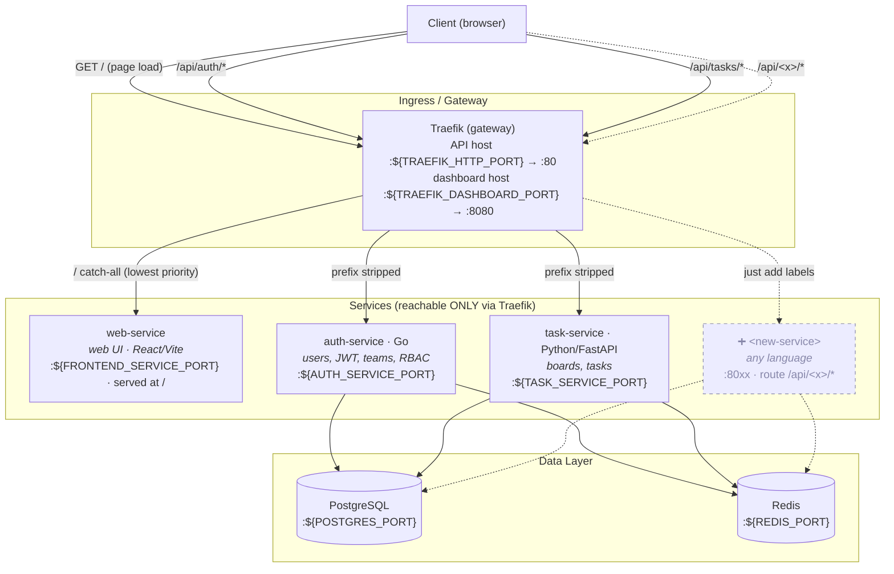

# Task Manager SaaS (learning build)

A minimal B2B task manager, built step by step to learn a polyglot microservice stack all in Docker:
  
  - **Traefik** (gateway) 
  - **Go** (auth) 
  - **Python/FastAPI** (tasks)
  - **PostgreSQL** 
  - **Redis**


> It's multi-tenant: users belong to **teams** with a **role** (owner / admin / member / viewer). A team owns **boards**, and each board is a **kanban** of tasks (To do / In progress / Done) that can be assigned to members. What each role can do is enforced by the auth-service and mirrored in the UI — log in as the seeded users to see the same action allowed for an owner and blocked (403) for a viewer.


## Architecture



Everything shares the `saas-net` Docker network. Traefik discovers each service from its container **labels** (no hand-written routes) and strips the `/api/<x>` prefix before forwarding, so each service serves clean paths (`/health`, not
`/api/auth/health`). The service ports (`web-service`, `auth-service`, `task-service`) are **not** published to the host; the only way in is through Traefik. Postgres and Redis *are* published (5432/6379) for local-dev convenience.

## Services

| Service           | Tier | Language       | Route via gateway | Internal port | Domain |
| ----------------- | ---- | -------------- | ----------------- | ------------- | --------- |
| `web-service`| web  | React/Vite     | `/` (catch-all)   | 3000          | web UI |
| `auth-service`    | API  | Go             | `/api/auth/*`     | 8000          | users, auth, JWT, teams, RBAC |
| `task-service`    | API  | Python/FastAPI | `/api/tasks/*`    | 8001          | boards, tasks |

## Layout

```bash
.
├── .env / .env.example         # config & secrets (ports, DB creds, JWT)
├── Makefile                    # make up / down / ps / logs / clean ...
├── auth-service/               # Go: identity & access
│   ├── main.go
│   ├── go.mod
│   ├── Dockerfile
│   ├── sqlc.yaml               # sqlc config
│   ├── queries/
│   │   ├── users.sql           # hand-written SQL (CreateUser, GetUserByEmail, GetUserByID)
│   │   └── teams.sql           # hand-written SQL (CreateTeam, GetTeamByID, GetTeamBySlug)
│   └── internal/
│     ├── db/                   # sqlc-GENERATED: never hand-edit
│     ├── auth/
│     │   ├── password.go       # bcrypt hash/verify
│     │   ├── token.go          # JWT access token (HS256) 
│     │   ├── session.go        # refresh token → Redis 
│     │   └── service.go        # Register/Login orchestration 
│     ├── config/
│     │   └── config.go        # configuration 
│     ├── db/
│     │   ├── models.go        # sqlc-GENERATED: never hand-edit
│     │   ├── teams.sql.go     # sqlc-GENERATED: never hand-edit
│     │   ├── users.sql.go     # sqlc-GENERATED: never hand-edit
│     │   └── db.go            # database connection
│     ├── rbac/
│     │   └── rbac.go          # rbac gating logic
│     ├── store/
│     │   └── store.go         # business logic abstraction layer
│     └── httpapi/
│         ├── auth.go          # auth handler
│         ├── health.go        # health handler
│         ├── middleware.go    # middleware handler
│         ├── router.go        # router handler
│         └── teams.go         # teams handler
├── web-service/               # frontend service
│   ├── Dockerfile
│   ├── package.json
│   └── src/
│       ├── App.tsx
│       └── main.tsx
├── task-service/               # Python/FastAPI: boards & tasks
│   ├── Dockerfile
│   ├── main.py
│   └── requirements.txt
└── infra/
    ├── compose.yaml            # the whole stack (profile: core)
    ├── gateway/
    │   ├── traefik.yml         # Traefik static config
    │   └── dynamic/            # Traefik dynamic config (later)
    └── database/
        ├── migrations/         # golang-migrate SQL migrations
        └── seed.sql            # seed data
```

## Configuration

All ports, DB credentials, and the JWT secret live in `.env` (copy from `.env.example`). Host-facing ports are configurable there; container-internal ports are fixed. Render the fully-resolved config any time with:

```bash
docker compose -f infra/compose.yaml --env-file .env config
```

## Quick start

```bash
cp .env.example .env   # create local config (ports, DB creds, JWT secret)
make up # build + start the stack
make migrate # apply DB migrations
make seed    # load demo data (all demo users share password: password123)
```

Then open the app at http://localhost and log in as `jay@example.com` / `password123`.

## Development

See **[IMPLEMENTATION.md](IMPLEMENTATION.md)** for dev workflows: Make targets, running migrations, and regenerating the sqlc DB layer (`make sqlc`).

## Production checklist / Not included

Consider this as a learning project, not a production-ready project. If you want to make it production-ready, you should add the following:
- **Security**
    - No TLS: HTTP only (traefik.yml just mentions TLS in a comment). Prod needs certs / ACME.
    - Refresh token in localStorage: XSS-exposable; the httpOnly-cookie hardening was deferred.
    - Secrets committed: real JWT secret + DB password live in .env.example. Prod needs a secrets manager and rotation.
    - Symmetric shared JWT secret across services: fine for a POC; prod typically moves to asymmetric (RS256 + JWKS) so services verify without holding the signing key.
    - No rate limiting, security headers, or CORS policy: zero protective middleware on the gateway.
- **Architecture**
    - Services share common database: `task-service/authz.py` literally reads `auth-service`'s `team_members` table directly ("THE one place…"). A deliberate POC shortcut, but it's shared-DB coupling, not true service isolation. Prod would use a token claim, an internal API, or an events/replication seam.
    - RBAC is team-wide; board-level scoping was deferred.
- **Operations & correctness**
    - No tests: no unit/integration/e2e.
    - No CI/CD: no .github, .circleci, .gitlab, etc.
    - No observability: no metrics, tracing, structured logs, or aggregation.
    - Single-node Postgres/Redis: no HA, no backups, no connection pooling story.

Happy coding 🚀
