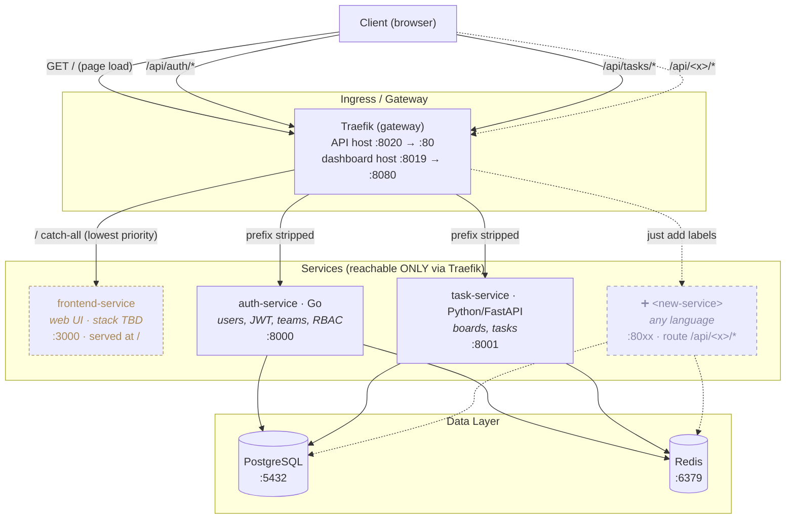

# Task Manager SaaS (learning build)

A minimal B2B task manager, built step by step to learn a polyglot microservice stack all in Docker:
  
  - **Traefik** (gateway) 
  - **Go** (auth) 
  - **Python/FastAPI** (tasks)
  - **PostgreSQL** 
  - **Redis**

## Architecture



Everything shares the `saas-net` Docker network. Traefik discovers each service from its container **labels** (no hand-written routes) and strips the `/api/<x>` prefix before forwarding, so each service serves clean paths (`/health`, not
`/api/auth/health`). The service ports (3000/3001) are **not** published to the host the only way in is through Traefik. Postgres and Redis *are* published (5432/6379) for local-dev convenience.

## Services

| Service           | Tier | Language       | Route via gateway | Internal port | Domain |
| ----------------- | ---- | -------------- | ----------------- | ------------- | --------- |
| `frontend-service`| web  | TBD            | `/` (catch-all)   | 3000          | web UI |
| `auth-service`    | API  | Go             | `/api/auth/*`     | 8000          | users, auth, JWT, teams, RBAC |
| `task-service`    | API  | Python/FastAPI | `/api/tasks/*`    | 8001          | boards, tasks |

## Layout

```bash
.
├── .env / .env.example         # config & secrets (ports, DB creds, JWT)
├── Makefile                    # make up / down / ps / logs / clean ...
├── auth-service/               # Go: identity & access
│   ├── main.go
│   ├── go.mod
│   ├── Dockerfile
│   ├── sqlc.yaml               # sqlc config
│   ├── queries/users.sql       # hand-written SQL (CreateUser, GetUserByEmail, GetUserByID)
│   └── internal/
│     ├── db/                   # sqlc-GENERATED: never hand-edit
│     ├── auth/
│     │   ├── password.go       # bcrypt hash/verify (TODO)
│     │   ├── token.go          # JWT access token (HS256)  (TODO)
│     │   ├── session.go        # refresh token → Redis  (TODO)
│     │   └── service.go        # Register/Login orchestration  (TODO)
│     └── httpapi/
│         ├── auth.go             # handlers + request/response DTOs (TODO)
│         └── router.go           # + POST /register,/login  (TODO)
├── frontend-service/           # frontend service
│   └── Dockerfile
├── task-service/               # Python/FastAPI: boards & tasks
│   ├── main.py
│   ├── requirements.txt
│   └── Dockerfile
└── infra/
    ├── compose.yaml            # the whole stack (profile: core)
    ├── gateway/
    │   ├── traefik.yml         # Traefik static config
    │   └── dynamic/            # Traefik dynamic config (later)
    └── database/
        └── migrations/         # golang-migrate SQL migrations
```

## Configuration

All ports, DB credentials, and the JWT secret live in `.env` (copy from `.env.example`). Host-facing ports are configurable there; container-internal ports are fixed. Render the fully-resolved config any time with:

```bash
docker compose -f infra/compose.yaml --env-file .env config
```

## Quick start

```bash
make up # build + start the stack
make migrate # apply DB migrations
make smoke # verify the gateway + services are healthy
```

## Development

See **[IMPLEMENTATION.md](IMPLEMENTATION.md)** for dev workflows: Make targets, running migrations, and regenerating the sqlc DB layer (`make sqlc`).