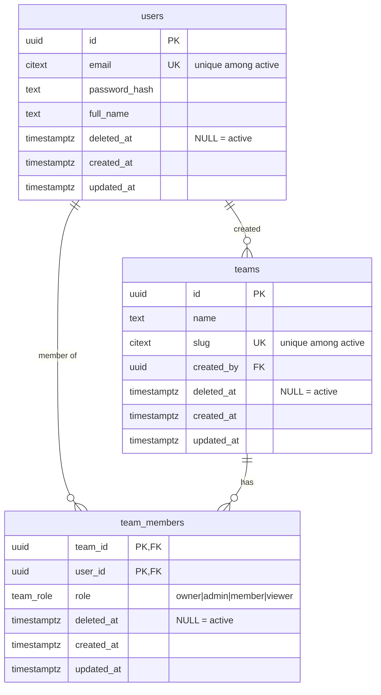

# Database

PostgreSQL 18 schema for the identity domain, managed with **golang-migrate**.

- **Migrations:** `migrations/`: run via `make migrate` / `make migrate-down` / `make migrate-version`
- **Conventions:** `uuidv7()` PKs · `citext` for email/slug · `timestamptz` everywhere · soft delete via `deleted_at` + partial unique indexes (`WHERE deleted_at IS NULL`)

## Schema

`team_members` is the join table between `users` and `teams` (many-to-many) and carries each member's role. `teams.created_by` references the user who created the team.
